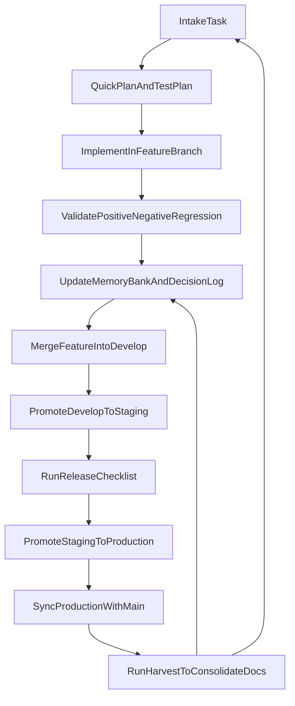

# SPINE

SPINE is the backbone framework on top of which agents operate.

It is a reusable instruction and workflow repository for local projects, designed for solo development with predictable execution, low coupling, and pragmatic quality controls. It started as a personal operating system and is now shared with the community.

## Why SPINE Exists

This repository centralizes:
- delivery workflow (adapted GitFlow for solo development);
- skill governance (minimal allowlist and controlled trials);
- quality guardrails (test-first validation discipline);
- memory-bank structure for context, decisions, and continuous learning.

The goal is to avoid rebuilding process from scratch on every new repository.

## Core Principles

- Simplicity first: no overengineering.
- Minimal rules, but non-optional.
- Opt-in per project: Spine rules are only loaded when a project explicitly opts in.
- Every delivery leaves quality evidence (test + memory + decision).
- Lessons learned become operational standards.

## Repository Layout

```text
spine/
├── templates/
│   └── docs/
│       ├── memory/ (empty templates for bootstrap)
│       ├── governance/
│       ├── quality/
│       └── workflow/
├── docs/ (internal Spine use - not versioned)
├── commands/
│   ... (execution command templates)
├── agents/
│   ... (OpenCode agent definitions, e.g. ask.md)
├── skills/
│   ... (curated skill repository)
├── rules/
│   ... (source-of-truth rules in .md)
├── scripts/
│   ... (maintenance scripts)
└── tests/
```

## Setup

Spine installs **per project only**. Each consumer repository links to a local Spine clone via `.spine` and receives its own symlinks for rules, commands, and skills.

### 1. Clone Spine (machine-local)

Clone the Spine repository once on your machine (outside consumer project trees):

```bash
git clone https://github.com/OpsScaleAI/spine.git ~/Workspace/ide/spine
```

### 2. Link Spine to your project

From the consumer project root:

```bash
cd /path/to/my-project
bash ~/Workspace/ide/spine/scripts/link-spine.sh
```

This creates `.spine` → absolute path to the Spine repository. Use `--spine-dir=PATH` if the repo lives elsewhere, `--force` to replace a mismatched symlink, or `--dry-run` to preview.

### 3. Install project artefacts

```bash
bash .spine/install.sh          # all skills (default)
bash .spine/install.sh --core   # minimal 5-skill profile only
```

This creates (gitignored, machine-specific):

```text
PROJECT_ROOT/
├── .spine              → Spine repository
├── .agents/skills/     per-skill symlinks
├── .cursor/rules/      core rule symlinks
├── .cursor/commands/   command symlinks
├── .cursor/skills/     → .agents/skills/
├── .opencode/commands/ command symlinks
├── .opencode/agents/   agent symlinks (e.g. ask.md)
├── .claude/skills/     → .agents/skills/
└── opencode.json       created if missing (template)
```

### 4. Bootstrap (recommended)

Open the project in your agent IDE and run:

```
/spine-install
/spine-bootstrap
```

These commands will:
1. `/spine-install`: download `docs/` templates, configure `opencode.json`, and run `bash .spine/install.sh`.
2. `/spine-bootstrap`: perform initial project assessment and populate the memory bank.

If `.spine` is missing, run `scripts/link-spine.sh` before `/spine-install`.

#### Manual `opencode.json` (alternative)

Each Spine project opts in via `opencode.json` with `instructions` pointing to Spine rule URLs:

```json
{
  "$schema": "https://opencode.ai/config.json",
  "instructions": [
    "https://raw.githubusercontent.com/OpsScaleAI/spine/refs/heads/master/rules/01-core-protocol.md",
    "https://raw.githubusercontent.com/OpsScaleAI/spine/refs/heads/master/rules/02-memory-bank.md",
    "https://raw.githubusercontent.com/OpsScaleAI/spine/refs/heads/master/rules/03-code-quality.md"
  ]
}
```

> **Why URLs instead of local paths?**
> - **Portable:** works on any machine without a local Spine clone
> - **Auto-updating:** OpenCode fetches rules on each session; `git push` on Spine propagates changes
> - **Versionable:** pin to a tag (`refs/tags/v1.0.0`) for stability, or use `refs/heads/master` for latest
> - **Commitable:** `opencode.json` is plain JSON, safe to commit to the project repo

**Version pinning:** replace `refs/heads/master` with `refs/tags/v1.0.0` in each URL.

> **Important:** Never add Spine `instructions` to global `~/.config/opencode/opencode.json`. Rules and agents are opt-in per project only (`opencode.json` + `.opencode/agents/`).

### 5. Non-Spine projects

Projects that do not follow Spine simply omit Spine rule URLs from their `opencode.json`. They do not need `.spine` or `install.sh`.

### 6. Updating

From inside a consumer repository:

```bash
bash .spine/scripts/update.sh
```

This pulls the Spine repo via `.spine`, reconciles project symlinks (`install.sh --update --force`), syncs `opencode.json`, and preserves `docs/memory/`.

- **Rules:** Projects using URL-based `instructions` receive updates when OpenCode fetches rules each session.
- **Skills and commands:** `update.sh` reconciles symlinks after `git pull` on the Spine clone.

Optional update modes:

```bash
bash .spine/scripts/update.sh --dry-run
bash .spine/scripts/update.sh --replace-opencode
bash .spine/scripts/update.sh --with-graphify      # see "Optional: Graphify"
bash .spine/scripts/update.sh --graphify-init      # setup + first graph build
```

## Optional: Graphify

Graphify is an optional retrieval optimization layer for consumer projects. When `graphify-out/graph.json` exists in the project, Spine rules instruct agents to query the graph first during exploration, then fall back to direct file reads. The memory bank (`docs/memory/`) remains the operational source of truth. Graphify is recommended for medium/large repositories where broad file scanning increases input-token cost.

### Install CLI (once per machine)

```bash
uv tool install graphifyy    # recommended
# alternatives: pipx install graphifyy | pip install graphifyy
```

### New project (during initial setup)

From the consumer project root, after linking `.spine`:

```bash
bash .spine/install.sh --with-graphify --graphify-init
```

This copies `.graphifyignore` from the Spine template and runs `graphify update .`, producing `graphify-out/graph.json`.

### Existing project already using Spine

If the project already has `.spine`, `docs/memory/`, and symlinks, use one of these paths to generate `graphify-out` for the first time:

**Path A — install flags (minimal)**

```bash
cd /path/to/existing-project
bash .spine/install.sh --with-graphify --graphify-init
```

**Path B — via update (pull Spine + enable Graphify)**

```bash
cd /path/to/existing-project
bash .spine/scripts/update.sh --graphify-init
```

(`--graphify-init` implies `--with-graphify`.)

**Manual fallback** (if flags are unavailable on an old Spine clone):

```bash
bash .spine/scripts/install-graphify.sh --project-root=. --init-graph
```

### Verify activation

```bash
test -f graphify-out/graph.json && echo "Graphify active"
ls -la .graphifyignore
```

Agents use graph-first exploration once `graphify-out/graph.json` exists (see `rules/01-core-protocol.md` and `rules/02-memory-bank.md`).

### Refresh / regenerate `graphify-out`

After large refactors or when exploration feels stale:

```bash
graphify update .
```

### Git policy

- `graphify-out/` is machine-generated; most teams add `graphify-out/` to the project `.gitignore`.
- `.graphifyignore` is safe to commit (excludes Spine symlinks and Graphify cache artifacts).
- `graphify-out/graph.json` is the file agents check — it must exist locally even if gitignored.

### Troubleshooting

| Symptom | Fix |
|---|---|
| `graphify: command not found` | Install CLI: `uv tool install graphifyy` |
| No `graphify-out/graph.json` after setup | Run `graphify update .` manually from the project root |
| Graph build fails | Check `.graphifyignore`; ensure you are in the project root; rerun `graphify update .` |
| Agents still scan files broadly | Confirm `graphify-out/graph.json` exists; restart the agent session |

## Migration from v1.2 and earlier

| Old setup | Action |
|-----------|--------|
| Ran `bash install.sh` (global mode, removed in v1.3) | Remove Spine symlinks under `~/.cursor/`, `~/.config/opencode/`, `~/.claude/` if no longer wanted |
| Ask agent in `~/.config/opencode/agents/` | Remove global symlink: `rm ~/.config/opencode/agents/ask.md`; use per-project `.opencode/agents/` via `bash .spine/install.sh` |
| Consumer without `.spine` | Run `scripts/link-spine.sh`, then `bash .spine/install.sh` |
| Core-only skill symlinks | `bash .spine/scripts/update.sh` adds remaining skills (default is now `all`) |

### Migrating opencode.json (6 rules → 3)

If your consumer project still loads 6 Spine rules or an `AGENTS.md` in the system prompt, migrate to the token-optimized layout:

**What changed:**
- 6 rules in `opencode.json` → **3 core rules** (~79% smaller system prompt)
- `compaction` added (`threshold: 16000`)
- Consumer projects no longer use `AGENTS.md` in the system prompt — context lives in `docs/memory/`

**Steps:**

1. Update the Spine clone: `git -C .spine pull origin master`
2. Update `opencode.json` — use [`templates/opencode.json`](templates/opencode.json) as the canonical source (3 `instructions` URLs + `compaction` block)
3. Or run `/spine-update` / `bash .spine/scripts/update.sh` (merge mode syncs `opencode.json` non-destructively)
4. Refresh Cursor rules: `bash .spine/install.sh --update --targets=cursor`
5. Remove consumer-root `AGENTS.md` if present (optional)
6. Restart the agent session

**3 core rules:**

| Rule | Responsibility |
|---|---|
| `01-core-protocol.md` | Execution cycle, definition of done, commits, guard rails |
| `02-memory-bank.md` | Structure and reading of `docs/memory/` |
| `03-code-quality.md` | Style, architecture, error handling, security |

Removed rules (`handoff-protocol`, `testing`, `gitflow`) remain available as on-demand skills or `docs/` workflow files.

## Cursor Setup

> **Cursor users:** Spine rules are installed per project in `.cursor/rules/` (supports `.md` and `.mdc`). No global Spine installer is provided.

## Compatibility (Claude Code and Other Tools)

SPINE works with Claude Code and other AI agents via per-project symlinks (`.claude/skills/`, `.cursor/`, `.opencode/`). For other tools, adapt paths or file names to match the expected format.

## Slash Commands

Available command templates in `commands/`:
- `/spine-install` for project setup (templates, config, and symlinks).
- `/spine-update` to refresh an already-installed consumer project safely.
- `/spine-bootstrap` for initial project assessment and memory bootstrap.
- `/spine-plan` to create the active task plan in memory-bank.
- `/spine-execute` to implement the selected active task with validation cycle.
- `/spine-harvest` to consolidate delivery learnings and close the task.
- `/spine-commit` to create a high-quality commit with branch safety checks.

`/spine-update` wraps `scripts/update.sh` and is the recommended maintenance path for existing consumer projects.

## OpenCode Agents

Spine ships agent definitions in `agents/`. `install.sh` deploys them **per project only** to `.opencode/agents/` (per-file symlinks to `.spine/agents/`). Do not symlink Spine agents into global `~/.config/opencode/agents/` — OpenCode loads project agents from `.opencode/agents/` when working in that repository.

Available agents:

- **ask** (`ask.md`) — Read-only thinking partner. Loads memory bank context (SYNC order) and optional Graphify graph-first exploration. Explore ideas, validate approaches, and discuss architecture without modifying the codebase. Read-only bash diagnostics are allowed; state-changing operations are blocked. Switch to the **Build** agent and run `/spine-plan` when ready to implement.

## Skill Governance

- `install.sh` links the **full skill catalog** by default; use `--core` for the minimal 5-skill profile.
- **Active allowlist** (5–8 skills in workflow) is governed by `docs/governance/skills-policy.md` — not by omitting symlinks unless you choose `--core` or `--remove-skill`.
- Add trial skills with `bash .spine/install.sh --add-skill=NAME`.

## Operational Workflow

Detailed sources:
- `docs/workflow/gitflow-operacional.md`
- `docs/workflow/ciclo-de-entrega.md`
- `docs/quality/guardrails.md`

High-level flow:



## Solo Developer Daily Routine

- Before starting:
  - read `docs/workflow/ciclo-de-entrega.md`;
  - confirm acceptance criteria;
  - define a compact test plan.
- During implementation:
  - avoid new abstractions without at least two real use cases;
  - record relevant technical decisions.
- Before closing the task:
  - update `docs/memory/ledger/progress.md`;
  - record decisions in `docs/memory/global/decision-log.md`;
  - record avoidable mistakes and prevention notes.

## Monthly Maintenance

1. Review active skill allowlists and remove low-value entries.
2. Update roadmap and progress ledgers.
3. Convert recurring lessons into explicit operating rules.

## Author

- Fernando Juste - juste@opsscale.ai

## Version

**v1.3.0** — Project-only installation.

- Removed global installation mode from `install.sh`
- Added `scripts/link-spine.sh` to create the `.spine` symlink in consumer projects
- `install.sh` is project-only; default skills = all; `--core` for minimal profile
- `--global` and `--project` flags removed

<details>
<summary>Version history</summary>

**v1.2.0** — ASK agent and OpenCode agents deployment.

- Added `agents/ask.md` — read-only Ask agent for OpenCode (explore ideas, memory bank context)

**v1.1.0** — Per-project installation via URL.

- Rules loaded via remote URLs in project-level `opencode.json` (opt-in)
- `/spine-install` creates `opencode.json` with Spine rule URLs automatically

**v1.0.0** — First stable release.

- `install.sh` creates symlinks for Cursor, OpenCode, and Claude Code
- Rules in universal `.md` format (compatible with all agents)
- 34 curated skills, 7 slash commands, 3 framework rules

</details>

## References and Credits

This project was inspired by practical community work, especially:

- [antigravity-awesome-skills](https://github.com/sickn33/antigravity-awesome-skills)
- [Cursor Memory Bank (gist)](https://gist.github.com/ipenywis/1bdb541c3a612dbac4a14e1e3f4341ab)

There are additional references that influenced SPINE over time and may be added as they are recovered and verified.

---

SPINE is intentionally pragmatic: low ceremony, high clarity, and consistent execution.