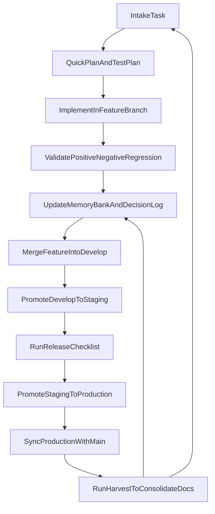

# SPINE

SPINE is the backbone framework on top of which agents operate.

It is a reusable instruction and workflow repository for local projects, designed for solo development with predictable execution, low coupling, and pragmatic quality controls. It started as a personal operating system and is now shared with the community.

## Why SPINE Exists

This repository centralizes:
- delivery workflow (adapted GitFlow for solo development);
- skill governance (minimal allowlist and controlled trials);
- quality guardrails (test-first validation discipline);
- memory-bank structure for context, decisions, and continuous learning.

The goal is to avoid rebuilding process from scratch on every new repository.

## Core Principles

- Simplicity first: no overengineering.
- Minimal rules, but non-optional.
- Every delivery leaves quality evidence (test + memory + decision).
- Lessons learned become operational standards.

## Repository Layout

```text
spine/
├── templates/
│   └── docs/
│       ├── memory/ (empty templates for bootstrap)
│       ├── governance/
│       ├── quality/
│       └── workflow/
├── docs/ (internal Spine use - not versioned)
├── commands/
│   ... (execution command templates)
├── skills/
│   ... (curated skill repository)
├── rules/
│   ... (source-of-truth rules in .md)
├── scripts/
│   ... (maintenance scripts)
└── tests/
```

## Quick Start (Recommended)

Run the installer to create global symlinks for OpenCode and Claude Code:

```bash
bash install.sh
```

This links skills, commands, and rules to their respective global config directories so they are available in any project.

> **Cursor users:** Global rules require manual setup via `Cursor Settings → General → Rules for AI`. Project rules go in `.cursor/rules/` (supports both `.md` and `.mdc`).

### Manual Symlink Setup

If you prefer manual setup, link SPINE into your project:

```bash
ln -s /path/to/spine/commands /path/to/your-project/commands-spine
ln -s /path/to/spine/skills /path/to/your-project/skills-spine
```

## Installation and Use (Cursor + Opencode)

SPINE was designed primarily for Cursor + Opencode workflows.

Recommended setup:
1. Clone this repository locally.
2. Keep `docs/`, `skills/`, and `commands/` in SPINE as the canonical source.
3. Link SPINE into your working project with symlinks.
4. Follow your project-local policy to activate only the necessary skills.

Practical skill activation strategy:
- Keep the full `skills/` directory in SPINE.
- Activate only the skills needed by the current project scope.
- Start with one base profile from `docs/governance/skills-policy.md`.
- Add at most two temporary trial skills.
- Target 5 to 8 active skills per project to reduce context noise.

### Slash Commands

Available command templates in `commands/`:
- `/spine-bootstrap` for initial project assessment and memory bootstrap.
- `/spine-plan` to create the active task plan in memory-bank.
- `/spine-execute` to implement the selected active task with validation cycle.
- `/spine-harvest` to consolidate delivery learnings and close the task.
- `/spine-commit` to create a high-quality commit with branch safety checks (solo default: push and confirm-before-merge; no default PR nudge).

## Compatibility (Claude Code and Other Tools)

SPINE also works with Claude Code and other AI agents.

The `install.sh` script creates global symlinks for both OpenCode and Claude Code automatically. For other tools, you may need to adapt paths or file names to match the expected format.

## Operational Workflow

Detailed sources:
- `docs/workflow/gitflow-operacional.md`
- `docs/workflow/ciclo-de-entrega.md`
- `docs/quality/guardrails.md`

High-level flow:



## Solo Developer Daily Routine

- Before starting:
  - read `docs/workflow/ciclo-de-entrega.md`;
  - confirm acceptance criteria;
  - define a compact test plan.
- During implementation:
  - avoid new abstractions without at least two real use cases;
  - record relevant technical decisions.
- Before closing the task:
  - update `docs/memory/ledger/progress.md`;
  - record decisions in `docs/memory/global/decision-log.md`;
  - record avoidable mistakes and prevention notes.

## Monthly Maintenance

1. Review active skill allowlists and remove low-value entries.
2. Update roadmap and progress ledgers.
3. Convert recurring lessons into explicit operating rules.

## Author

- Fernando Juste - juste@opsscale.ai

## Version

**v1.0.0** — First stable release with global installation support.

- `install.sh` creates symlinks for Cursor, OpenCode, and Claude Code
- Rules in universal `.md` format (compatible with all agents)
- 34 curated skills, 6 slash commands, 6 framework rules

## References and Credits

This project was inspired by practical community work, especially:

- [antigravity-awesome-skills](https://github.com/sickn33/antigravity-awesome-skills)
- [Cursor Memory Bank (gist)](https://gist.github.com/ipenywis/1bdb541c3a612dbac4a14e1e3f4341ab)

There are additional references that influenced SPINE over time and may be added as they are recovered and verified.

---

SPINE is intentionally pragmatic: low ceremony, high clarity, and consistent execution.
