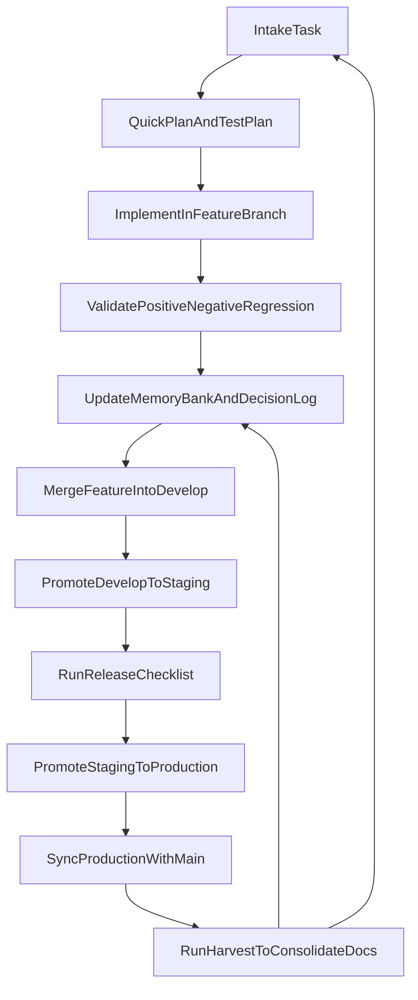

# SPINE

SPINE is the backbone framework on top of which agents operate.

It is a reusable instruction and workflow repository for local projects, designed for solo development with predictable execution, low coupling, and pragmatic quality controls. It started as a personal operating system and is now shared with the community.

## Why SPINE Exists

This repository centralizes:
- delivery workflow (adapted GitFlow for solo development);
- skill governance (minimal allowlist and controlled trials);
- quality guardrails (test-first validation discipline);
- memory-bank structure for context, decisions, and continuous learning.

The goal is to avoid rebuilding process from scratch on every new repository.

## Core Principles

- Simplicity first: no overengineering.
- Minimal rules, but non-optional.
- Opt-in per project: Spine rules are only loaded when a project explicitly opts in.
- Every delivery leaves quality evidence (test + memory + decision).
- Lessons learned become operational standards.

## Repository Layout

```text
spine/
├── templates/
│   └── docs/
│       ├── memory/ (empty templates for bootstrap)
│       ├── governance/
│       ├── quality/
│       └── workflow/
├── docs/ (internal Spine use - not versioned)
├── commands/
│   ... (execution command templates)
├── skills/
│   ... (curated skill repository)
├── rules/
│   ... (source-of-truth rules in .md)
├── scripts/
│   ... (maintenance scripts)
└── tests/
```

## Setup

### 1. Global Installation (one-time)

Clone Spine and run the installer. This makes skills and commands available in **all** projects via `/skill` and `/command`, but does **not** inject Spine rules into any project.

```bash
git clone https://github.com/OpsScaleAI/spine.git
cd spine
bash install.sh
```

This creates:
- `~/.config/opencode/skills/` → symlink to Spine `skills/`
- `~/.config/opencode/commands/` → symlink to Spine `commands/`
- `~/.cursor/rules/` → symlink to Spine `rules/`
- `~/.claude/rules/` → symlink to Spine `rules/`
- `~/.claude/skills/` → symlink to Spine `skills/`

> **Important:** The global OpenCode config (`~/.config/opencode/opencode.json`) must **not** contain Spine `instructions`. Rules are opt-in per project (step 2 below). If you have an `instructions` key pointing to Spine rules in the global config, remove it — otherwise all projects (even non-Spine ones) will receive Spine rules.

### 2. Per-Project Setup (opt-in)

Each project that follows the Spine framework must explicitly opt in by creating an `opencode.json` in the project root with `instructions` pointing to Spine rule URLs. This is done automatically by running `/spine-install` inside a new project, or manually.

#### Option A: Using /spine-install + /spine-bootstrap (recommended)

Open a project in OpenCode and run:

```
/spine-install
/spine-bootstrap
```

These commands will:
1. `/spine-install`: download templates to `docs/`, configure `opencode.json`, and run `install.sh --project` for symlinks.
2. `/spine-bootstrap`: perform initial project assessment and populate memory bank.

#### Option B: Manual setup

Create `opencode.json` in your project root:

```json
{
  "$schema": "https://opencode.ai/config.json",
  "instructions": [
    "https://raw.githubusercontent.com/OpsScaleAI/spine/refs/heads/master/rules/01-core-protocol.md",
    "https://raw.githubusercontent.com/OpsScaleAI/spine/refs/heads/master/rules/02-memory-bank.md",
    "https://raw.githubusercontent.com/OpsScaleAI/spine/refs/heads/master/rules/03-handoff-protocol.md",
    "https://raw.githubusercontent.com/OpsScaleAI/spine/refs/heads/master/rules/04-code-quality.md",
    "https://raw.githubusercontent.com/OpsScaleAI/spine/refs/heads/master/rules/05-testing.md",
    "https://raw.githubusercontent.com/OpsScaleAI/spine/refs/heads/master/rules/06-gitflow.md",
    "./AGENTS.md"
  ]
}
```

Then commit `opencode.json` to the project repository.

> **Why URLs instead of local paths?**
> - **Portable:** works on any machine without a local Spine clone
> - **Auto-updating:** OpenCode fetches rules on each session; `git push` on Spine propagates changes
> - **Versionable:** pin to a tag (`refs/tags/v1.0.0`) for stability, or use `refs/heads/master` for latest
> - **Commitable:** `opencode.json` is plain JSON, safe to commit to the project repo

#### Version Pinning

To lock Spine rules to a specific version, replace `refs/heads/master` with `refs/tags/v1.0.0`:

```
https://raw.githubusercontent.com/OpsScaleAI/spine/refs/tags/v1.0.0/rules/01-core-protocol.md
```

### 3. Non-Spine Projects

Projects that do **not** follow the Spine framework simply don't include Spine rule URLs in their `opencode.json`. They remain completely free of Spine rules while still having access to the global skills and commands catalog.

Example `opencode.json` for a non-Spine project:

```json
{
  "$schema": "https://opencode.ai/config.json",
  "model": "opencode-go/glm-5.1"
}
```

### 4. Updating Spine Rules

- **Rules:** No action needed. Projects using URL-based `instructions` automatically receive updates when OpenCode fetches the rules on each session.
- **Skills and Commands:** Run `git pull` in the Spine repository. Global symlinks point to the local clone, so updates are immediate.

## Cursor Setup

> **Cursor users:** Global rules require manual setup via `Cursor Settings → General → Rules for AI`. Project rules go in `.cursor/rules/` (supports both `.md` and `.mdc`).

## Compatibility (Claude Code and Other Tools)

SPINE also works with Claude Code and other AI agents.

The `install.sh` script creates global symlinks for both OpenCode and Claude Code automatically. For other tools, you may need to adapt paths or file names to match the expected format.

## Slash Commands

Available command templates in `commands/`:
- `/spine-install` for project setup (templates, config, and symlinks).
- `/spine-bootstrap` for initial project assessment and memory bootstrap.
- `/spine-plan` to create the active task plan in memory-bank.
- `/spine-execute` to implement the selected active task with validation cycle.
- `/spine-harvest` to consolidate delivery learnings and close the task.
- `/spine-commit` to create a high-quality commit with branch safety checks.

## Skill Governance

Practical skill activation strategy:
- Keep the full `skills/` directory in SPINE.
- Activate only the skills needed by the current project scope.
- Start with one base profile from `docs/governance/skills-policy.md`.
- Add at most two temporary trial skills.
- Target 5 to 8 active skills per project to reduce context noise.

## Operational Workflow

Detailed sources:
- `docs/workflow/gitflow-operacional.md`
- `docs/workflow/ciclo-de-entrega.md`
- `docs/quality/guardrails.md`

High-level flow:



## Solo Developer Daily Routine

- Before starting:
  - read `docs/workflow/ciclo-de-entrega.md`;
  - confirm acceptance criteria;
  - define a compact test plan.
- During implementation:
  - avoid new abstractions without at least two real use cases;
  - record relevant technical decisions.
- Before closing the task:
  - update `docs/memory/ledger/progress.md`;
  - record decisions in `docs/memory/global/decision-log.md`;
  - record avoidable mistakes and prevention notes.

## Monthly Maintenance

1. Review active skill allowlists and remove low-value entries.
2. Update roadmap and progress ledgers.
3. Convert recurring lessons into explicit operating rules.

## Author

- Fernando Juste - juste@opsscale.ai

## Version

**v1.1.0** — Per-project installation via URL.

- Rules loaded via remote URLs in project-level `opencode.json` (opt-in)
- `/spine-install` creates `opencode.json` with Spine rule URLs automatically
- Global config no longer contains Spine instructions (non-Spine projects unaffected)
- Skills and commands remain globally available via symlinks

<details>
<summary>Version history</summary>

**v1.0.0** — First stable release with global installation support.

- `install.sh` creates symlinks for Cursor, OpenCode, and Claude Code
- Rules in universal `.md` format (compatible with all agents)
- 34 curated skills, 6 slash commands, 6 framework rules

</details>

## References and Credits

This project was inspired by practical community work, especially:

- [antigravity-awesome-skills](https://github.com/sickn33/antigravity-awesome-skills)
- [Cursor Memory Bank (gist)](https://gist.github.com/ipenywis/1bdb541c3a612dbac4a14e1e3f4341ab)

There are additional references that influenced SPINE over time and may be added as they are recovered and verified.

---

SPINE is intentionally pragmatic: low ceremony, high clarity, and consistent execution.